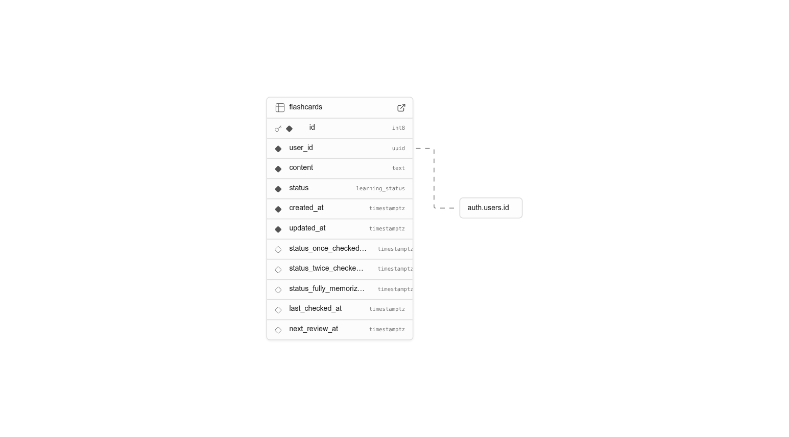

# Language Learning App

A flashcard-based language learning application with scientifically-backed spaced repetition to help you learn vocabulary and phrases effectively.

## Features

- Create and manage flashcards for language learning
- Spaced repetition system based on learning status
- Integration with Supabase for authentication and data storage
- Progressive learning path: cards are reviewed in intervals of 24 and 48 hours
- Visualization of learning progress
- Multiple views for due cards, all cards, and adding new content

## How Spaced Repetition Works

This application implements a proven spaced repetition algorithm to optimize your memory retention:

1. **Initial Learning**: New vocabulary starts in the "to-learn" state
2. **First Review**: After you successfully review a card for the first time, it moves to "once-checked"
   * The card will not appear again for 24 hours
3. **Second Review**: After reviewing a card that was previously "once-checked", it moves to "twice-checked"
   * The card will not appear again for 48 hours
4. **Final Review**: After reviewing a "twice-checked" card, it moves to "fully-memorized"
   * The card is now considered part of your long-term memory

This carefully timed sequence leverages the psychological spacing effect to strengthen memory formation with each review occurring at the optimal time to prevent forgetting.

## Setup Instructions

1. Clone this repository
2. Install dependencies:
   ```
   pip install -r requirements.txt
   ```
3. Set up a Supabase project at [supabase.com](https://supabase.com)
4. Execute the SQL commands below to create your database schema
5. Create a `.env` file in the root directory with the following variables:
   ```
   SUPABASE_URL=your_supabase_url
   SUPABASE_KEY=your_supabase_key
   ```
6. Run the application:
   ```
   streamlit run main.py
   ```

## Usage

1. Sign up or log in to your account
2. Add new vocabulary or phrases to learn in the "Add New" tab
3. Practice with flashcards that are due for review in the "Due for Review" tab
4. Track your progress as words move from "to-learn" to "fully-memorized"
5. Manage all your flashcards in the "All Flashcards" tab

---


## Memory Management Logic

The application implements an effective memory management strategy based on cognitive science principles:

1. **Initial Encoding**: When you add a new flashcard, it's immediately available for review

2. **Spaced Reviews**: 
   - First successful review → Wait 24 hours
   - Second successful review → Wait 48 hours
   - Third successful review → Marked as fully memorized

3. **Status Tracking**:
   - The app tracks exactly when each card entered each learning status
   - The `next_review_at` field determines when a card is due for review
   - Cards are shown in order of when they become due

4. **Memory Optimization**:
   - The carefully timed intervals maximize retention while minimizing study time
   - Each review strengthens the neural pathways associated with the memory
   - The progression from short to longer intervals follows the forgetting curve


---

## Database Schema



The app uses a Supabase PostgreSQL database with the following structure:

### 1. Learning Status ENUM Type

```sql
CREATE TYPE learning_status AS ENUM (
    'to-learn',
    'once-checked',
    'twice-checked',
    'fully-memorized'
);
```

### 2. Flashcards Table

```sql
CREATE TABLE flashcards (
    id BIGSERIAL PRIMARY KEY,
    user_id UUID NOT NULL REFERENCES auth.users(id) ON DELETE CASCADE,

    content TEXT NOT NULL,

    status learning_status NOT NULL DEFAULT 'to-learn',

    created_at TIMESTAMPTZ NOT NULL DEFAULT NOW(),
    updated_at TIMESTAMPTZ NOT NULL DEFAULT NOW(),

    status_once_checked_at TIMESTAMPTZ,
    status_twice_checked_at TIMESTAMPTZ,
    status_fully_memorized_at TIMESTAMPTZ,

    last_checked_at TIMESTAMPTZ,
    next_review_at TIMESTAMPTZ
);
```

### 3. Updated_at Trigger Function

```sql
CREATE OR REPLACE FUNCTION update_updated_at_column()
RETURNS TRIGGER AS $$
BEGIN
    NEW.updated_at = NOW();
    RETURN NEW;
END;
$$ LANGUAGE plpgsql;

CREATE TRIGGER update_flashcards_updated_at
BEFORE UPDATE ON flashcards
FOR EACH ROW
EXECUTE FUNCTION update_updated_at_column();
```

### 4. Indexes for Performance

```sql
CREATE INDEX idx_flashcards_user_id ON flashcards (user_id);
CREATE INDEX idx_flashcards_status ON flashcards (status);
CREATE INDEX idx_flashcards_user_status_next_review ON flashcards (user_id, status, next_review_at)
WHERE status != 'fully-memorized';
```
