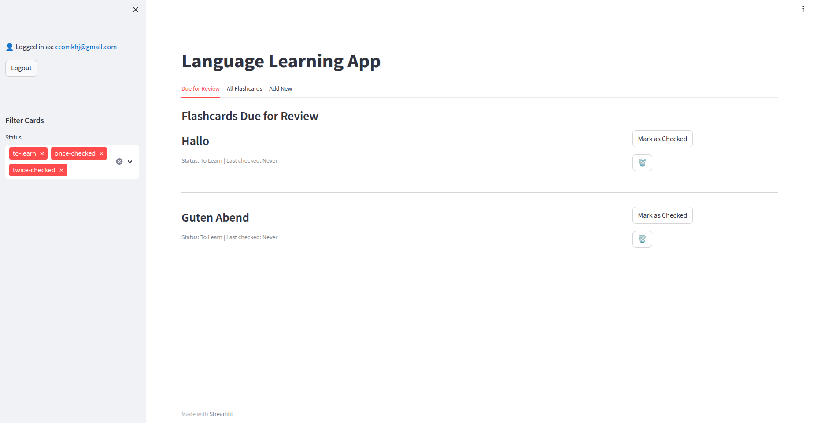

# Memory-Focused Language Learning App

A language learning application with scientifically-backed spaced repetition flashcards and an AI language tutor to help you learn vocabulary and phrases effectively.



## Features

- Create and manage flashcards for language learning
- Spaced repetition system based on learning status
- AI-powered language tutor for interactive learning conversations
- Learning progress reports and analysis of your strengths and weaknesses
- Integration with Supabase for authentication and data storage
- Progressive learning path: cards are reviewed in intervals of 24 and 48 hours
- Visualization of learning progress
- Multiple views for due cards, all cards, and adding new content
- Chat history with previous conversations and learning reports

## How Spaced Repetition Works

This application implements a proven spaced repetition algorithm to optimize your memory retention:

1. **Initial Learning**: New vocabulary starts in the "to-learn" state
2. **First Review**: After you successfully review a card for the first time, it moves to "once-checked"
   - The card will not appear again for 24 hours
3. **Second Review**: After reviewing a card that was previously "once-checked", it moves to "twice-checked"
   - The card will not appear again for 48 hours
4. **Final Review**: After reviewing a "twice-checked" card, it moves to "fully-memorized"
   - The card is now considered part of your long-term memory

This carefully timed sequence leverages the psychological spacing effect to strengthen memory formation with each review occurring at the optimal time to prevent forgetting.

## Setup Instructions

1. Clone this repository
2. Install dependencies:
   ```
   pip install -r requirements.txt
   ```
3. Set up a Supabase project at [supabase.com](https://supabase.com)
4. Execute the SQL commands below to create your database schema
5. Create a `.env` file in the root directory with the following variables:

   ```bash
   SUPABASE_URL=your_supabase_url
   SUPABASE_KEY=your_supabase_key
   OPENAI_API_KEY=your_openai_api_key
   ```

6. Install required packages using conda or pip:

   ```bash
   conda activate your_environment
   pip install -r requirements.txt
   ```

7. Run the application:

   ```bash
   streamlit run app/main.py
   ```

## Usage

1. Sign up or log in to your account
2. Use the sidebar to navigate between Flashcards and Tutor Chat
3. Create and review flashcards, or have interactive conversations with your AI language tutor
4. Add new vocabulary or phrases to learn in the "Add New" tab
5. Practice with flashcards that are due for review in the "Due for Review" tab
6. Track your progress as words move from "to-learn" to "fully-memorized"
7. Manage all your flashcards in the "All Flashcards" tab

---

## Memory Management Logic

The application implements an effective memory management strategy based on cognitive science principles:

1. **Initial Encoding**: When you add a new flashcard, it's immediately available for review

2. **Spaced Reviews**:
   - First successful review → Wait 24 hours
   - Second successful review → Wait 48 hours
   - Third successful review → Marked as fully memorized

3. **Status Tracking**:
   - The app tracks exactly when each card entered each learning status
   - The `next_review_at` field determines when a card is due for review
   - Cards are shown in order of when they become due

4. **Memory Optimization**:
   - The carefully timed intervals maximize retention while minimizing study time
   - Each review strengthens the neural pathways associated with the memory
   - The progression from short to longer intervals follows the forgetting curve


---

## Database Schema


The app uses a Supabase PostgreSQL database with the following structure:

### 1. Learning Status ENUM Type

```sql
CREATE TYPE learning_status AS ENUM (
    'to-learn',
    'once-checked',
    'twice-checked',
    'fully-memorized'
);
```

### 2. Flashcards Table

```sql
CREATE TABLE IF NOT EXISTS public.flashcards (
    id UUID PRIMARY KEY DEFAULT uuid_generate_v4(),
    user_id UUID NOT NULL,
    content TEXT NOT NULL,
    status TEXT NOT NULL DEFAULT 'to-learn',
    created_at TIMESTAMP WITH TIME ZONE DEFAULT NOW(),
    updated_at TIMESTAMP WITH TIME ZONE DEFAULT NOW(),
    next_review_at TIMESTAMP WITH TIME ZONE DEFAULT NOW()
);

CREATE INDEX IF NOT EXISTS idx_flashcards_user_id ON public.flashcards(user_id);
CREATE INDEX IF NOT EXISTS idx_flashcards_status ON public.flashcards(status);
CREATE INDEX IF NOT EXISTS idx_flashcards_next_review_at ON public.flashcards(next_review_at);
```

### 3. Chat History Table

```sql
CREATE TABLE IF NOT EXISTS public.chat_history (
    id UUID PRIMARY KEY DEFAULT uuid_generate_v4(),
    user_id UUID NOT NULL,
    conversation TEXT NOT NULL,
    summary TEXT,
    created_at TIMESTAMP WITH TIME ZONE DEFAULT NOW()
);

CREATE INDEX IF NOT EXISTS idx_chat_history_user_id ON public.chat_history(user_id);
CREATE INDEX IF NOT EXISTS idx_chat_history_created_at ON public.chat_history(created_at);
```

### 4. Updated_at Trigger Function

## AI Language Tutor

The application features an AI-powered language tutor with the following capabilities:

- **Interactive Conversations**: Practice your target language with a responsive tutor that adapts to your learning level.
- **Personalized Learning**: The tutor analyzes your flashcards to focus on your specific vocabulary needs.
- **Progress Reports**: After each conversation, receive a detailed analysis of your strengths, weaknesses, and suggestions for improvement.
- **Chat History**: Review your previous conversations and learning progress over time.

### Using the Tutor Chat

1. Select your target language from the dropdown menu.
2. Type your question or message in the chat input at the bottom of the page.
3. The AI tutor will respond with helpful explanations, examples, or corrections.
4. After your conversation, check the Learning Progress Report for insights and recommendations.
5. Your chat history is saved automatically for future reference.

### Technical Implementation

The AI tutor is built using:

- CrewAI for agent-based conversational AI
- OpenAI's GPT-4 for natural language processing
- Supabase for chat history storage and retrieval
- Streamlit for the user interface

### Requirements

To use the AI tutor feature, you must:

1. Have a valid OpenAI API key in your `.env` file
2. Run the SQL commands to create the chat_history table in your Supabase project
3. Install all required dependencies from requirements.txt

```sql
CREATE OR REPLACE FUNCTION update_updated_at_column()
RETURNS TRIGGER AS $$
BEGIN
    NEW.updated_at = NOW();
    RETURN NEW;
END;
$$ LANGUAGE plpgsql;

CREATE TRIGGER update_flashcards_updated_at
BEFORE UPDATE ON flashcards
FOR EACH ROW
EXECUTE FUNCTION update_updated_at_column();
```

### 4. Indexes for Performance

```sql
CREATE INDEX idx_flashcards_user_id ON flashcards (user_id);
CREATE INDEX idx_flashcards_status ON flashcards (status);
CREATE INDEX idx_flashcards_user_status_next_review ON flashcards (user_id, status, next_review_at)
WHERE status != 'fully-memorized';
```
